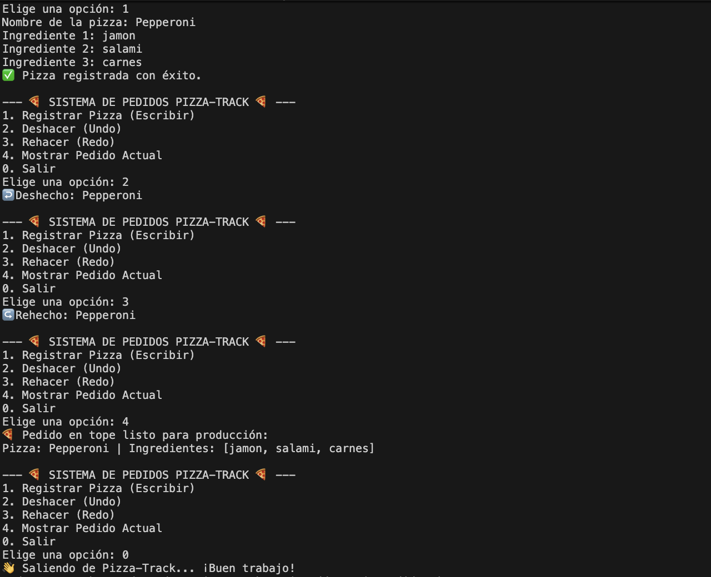

# 🍕 Pizza-Track: Sistema de Gestión de Pedidos

## 🎯 Objetivo
Comprender el concepto de pila y su estructura lógica, aplicándolo en un simulador de gestión de pedidos (Undo/Redo) para una pizzería, implementado en Java utilizando listas ligadas manuales.

## 📚 Comprensión Teórica
**¿Qué es una Pila (Stack)?**
Una pila es una estructura de datos lineal que sigue el principio **LIFO** (Last In, First Out - Último en entrar, Primero en salir). Funciona como una pila física de platos: el último elemento que se agrega a la cima es el primero que se debe retirar.

**Aplicación al Sistema Undo/Redo en Pizza-Track:**
- **Undo (Deshacer):** Utilizamos la *Pila Principal*. Al registrar un pedido, se apila (`push()`). Si el usuario desea deshacer la acción, retiramos el tope (`pop()`) y lo movemos a la Pila Secundaria.
- **Redo (Rehacer):** Utilizamos la *Pila Secundaria*. Almacena temporalmente los pedidos deshechos. Si el usuario decide rehacer, sacamos el pedido de esta pila (`pop()`) y lo regresamos a la Pila Principal (`push()`).

## 🚀 Instrucciones de Ejecución
1. Abre una terminal en la carpeta raíz del proyecto.
2. Compila los archivos Java ejecutando: `javac *.java`
3. Inicia el simulador ejecutando: `java GestionPedidos`

## 📸 Capturas de Pantalla

## 👥 Autores
- Jorge Alejandro Rubio Giraldo

## 🎥 Sustentación (Video)
**Enlace al video:** [link]